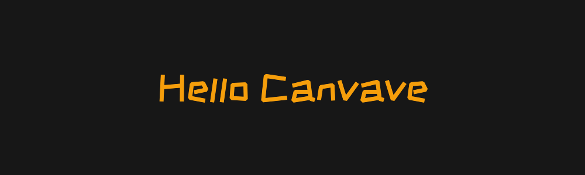
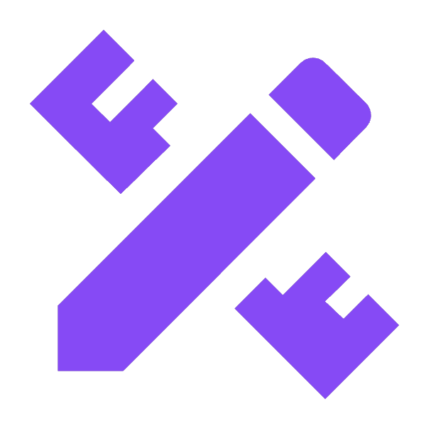
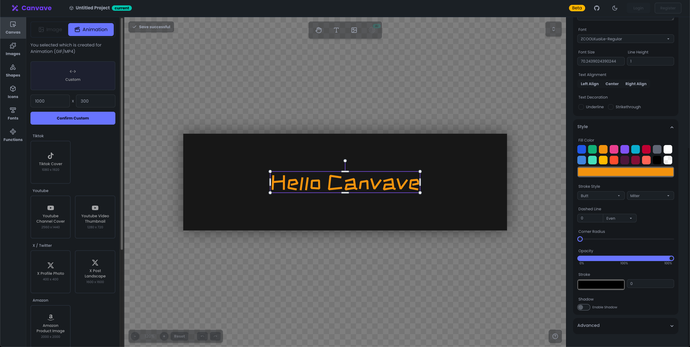

# Canvave

[Canvave](https://canvave.com/) is a design platform for creating image or animation.

I used to make posters, banners, and animations by some design tools, but most of them were too confusing for me, the heavy functions and materials dazzled me. I really need a a simple and clear interface and operation. So Canvave was born. You can create images/animations of any size (up to 3x resolution and 240FPS in the near future) on a simple panel.

- 🪄 Easy for creating animations
- 🎨 Good for any size images
- 📦 Customize shapes/fonts/images
- ⚡️ Export image and export animation as GIF/MP4 for free 
- 🚀 AI feature is coming soon

This repo is used to report issues or updates.

> It still in Beta now.
